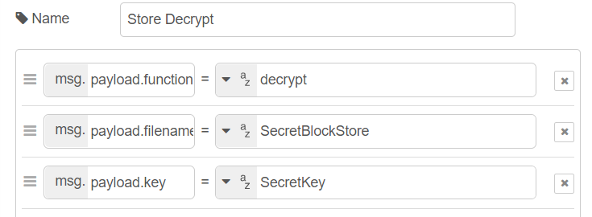

# node-red-contrib-crypto-storage :package: 

This is a subflow node for encrypting / decrypting payloads, creating an encrypted store on the specified folder utiling AES for block and Rabbit for stream ciphering.

## Install :zap:

Run the following command in your Node-RED user directory - typically `~/.node-red`

        npm install node-red-contrib-crypto-storage

## Information :information_source:
This subflow provides functionalities cipher functionalities for preserving the confidentiality of payloads.

## Cipher API :closed_lock_with_key:
The __plaintext__ payload can be either a string or an object, you must define the __function__ to use (``encrypt``/``decrypt``), the cipher __key__ and the __type__ of cipher to use (``AES``*/Block Cipher* or ``Rabbit``*/Stream Cipher*).

:warning: In the case of ``AES``, the __mode__ (``CBC/CFB/OFB/CTR``) parameter must also be set!    

---

### Cipher Encrypt Payload :key: :arrow_right:
* Setting the payload of the **Cipher Encrypt** injector:

---

### Cipher Encrypt Response :back: :lock:
* Encryption response payload:

---

### Cipher Decrypt Payload :key: :arrow_right:
* Setting the payload of the **Cipher Decrypt** injector:

---

### Cipher Decrypt Response :unlock: :back: 
* Decryption response payload:

## Cipher Store API :toolbox:
The __plaintext__ payload can be either a string or an object, you must define the __function__ to use (``encrypt``/``decrypt``), the cipher __key__ and the __filename__ of the crypto storage. 

You firstly need to define the __path__ of the store in the properties of the subflow:

:warning: In the case of ``AES``, the __mode__ (``CBC/CFB/OFB/CTR``) parameter must also be set!    

---

### Store Encrypt Payload :key: :arrow_right: :toolbox:
* Setting the payload of the **Store Encrypt** injector:

---

### Store Encrypt Response :back: :lock: 
* Store encryption response payload:

---

### Store Decrypt Payload :key: :arrow_right: :toolbox:
* Setting the payload of the **Store Decrypt** injector:

---

### Store Decrypt Response :unlock: :back: :toolbox: 
* Store decryption response payload:

